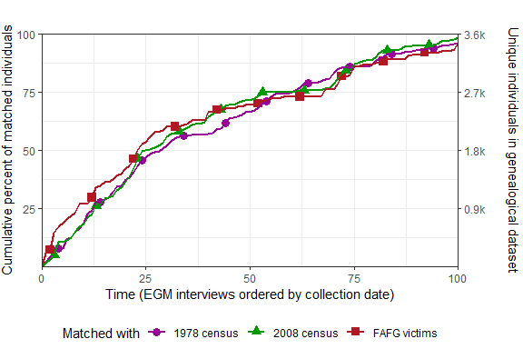
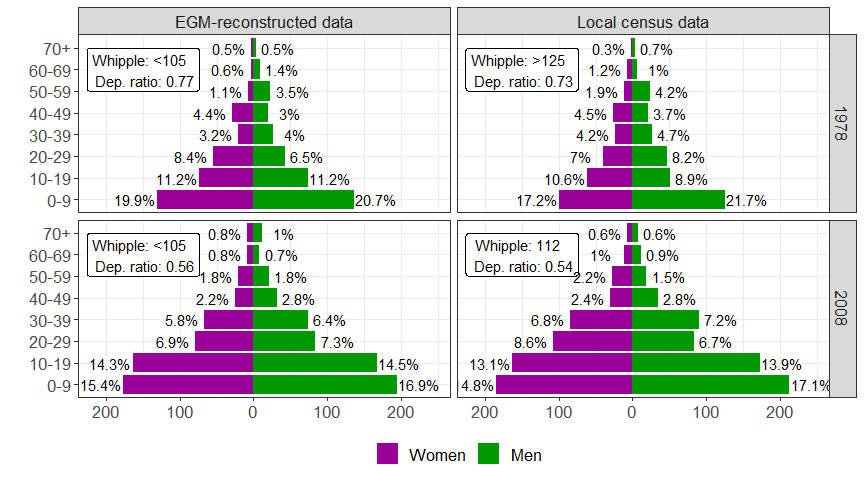
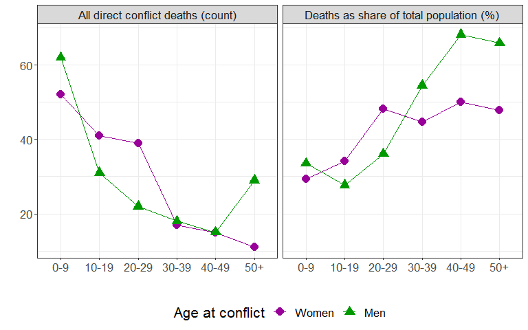
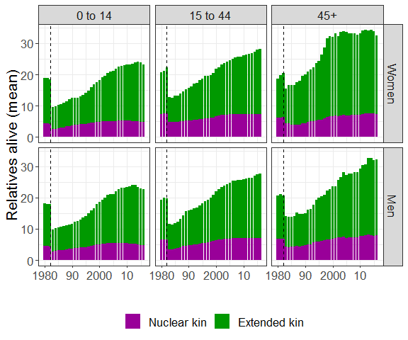
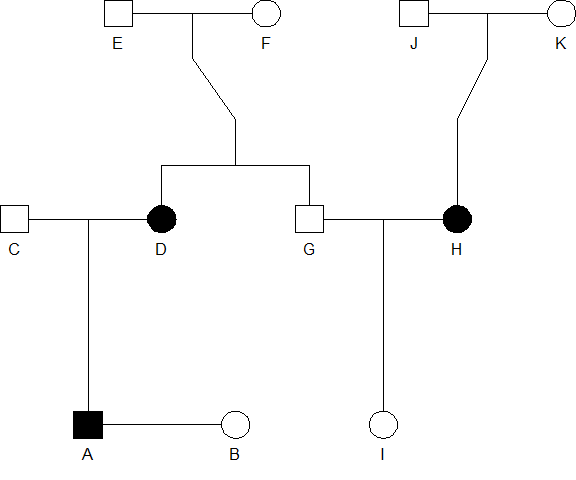

Reproducible results and figures
================

-   [Structure of the data](#structure-of-the-data)
-   [Reproducing results from the paper](#reproducing-results-from-the-paper)
    -   [Figure 2. Completion rates by matching](#figure-2.-completion-rates-by-matching)
    -   [Figure 3. Compare to local censuses of 1981 and 2008 census](#figure-3.-compare-to-local-censuses-of-1981-and-2008-census)
    -   [Figure 4 Conflict mortality profile](#figure-4-conflict-mortality-profile)
    -   [Figure 5. Family size over time](#figure-5.-family-size-over-time)
    -   [Table 1. EGM data quality and completeness by characteristics of reported individual.](#table-1.-egm-data-quality-and-completeness-by-characteristics-of-reported-individual.)
    -   [Figure 1. Genealogical diagram](#figure-1.-genealogical-diagram)
-   [Session information](#session-information)

This document presents the code needed to reproduce the empirical analysis, figures, and tables presented in the paper "Blood is thicker than bloodshed: A genealogical approach to reconstruct populations after armed conflicts". using the data collected in Rio Negro. The package `EGM` is needed to reproduce the results of this study. It can be downloaded from Github using the `devtools` package in R:

``` r
  library(devtools)
  install_github("alburezg/EGM", dep = FALSE)
```

After installation, the package can be loaded, together with the other packages needed for the analysis (see version numbers and other technical details at the end of this document):

``` r
library(EGM.confidential)

library(igraph)
library(ggplot2)
library(dplyr)
library(purrr)
library(stringr)
library(lubridate)
library(plyr)
library(knitr)
```

Structure of the data
---------------------

The microdata data from Rio Negro cannot be shared in full given privacy concerns. The raw data includes sensitive information such as date of birth, date of death, and kinship ties, which could be used to uniquely identify members of the population. Nevertheless, this section provides a brief overview of the seven datasets referenced in the code below. Note that the datasets presented in this section is for illustrative purposes and only include the columns referenced in the anlaysis.

The first dataset, `paradata`, records information data about the EGM interviews themselves, such as household id, unique id of the respondent, number of relatives reported, etc.

``` r
paradata %>% head %>% kable
```

|  h\_id|  respondent1|  no\_u\_members|
|------:|------------:|---------------:|
|      1|           12|              47|
|      2|            2|              32|
|      3|            1|              81|
|      4|           12|             121|
|      5|           13|              14|
|      6|            5|              43|

The `ind.q` dataset is a joint collection of all individuals reported in the EGM interviews, without removing duplicates. Having the original data with duplicates is useful for studying genealogical saturation and multiple reporting.

``` r
ind.q %>% head %>% kable
```

|  h\_id| interview\_date |  ind\_id| full\_id |  id81|  id08|  idall| DoB        | origin\_comunidad |  alive|  father|  mother|  spouse1|  spouse2|  spouse3|  spouse4|  spouse5|  spouse6| spouse7 | spouse8 |
|------:|:----------------|--------:|:---------|-----:|-----:|------:|:-----------|:------------------|------:|-------:|-------:|--------:|--------:|--------:|--------:|--------:|--------:|:--------|:--------|
|      1| 26/01/2016      |        1| 1\_1     |   555|   575|      1| 28/02/1954 | rio negro         |      1|       8|       9|        2|       NA|       NA|       NA|       NA|       NA| NA      | NA      |
|      1| 26/01/2016      |        2| 1\_2     |   554|    NA|      2| 10/03/1939 | NA                |      0|      NA|      NA|        1|       NA|       NA|       NA|       NA|       NA| NA      | NA      |
|      1| 26/01/2016      |        3| 1\_3     |   699|   570|      3| 07/10/1978 | rio negro         |      1|       2|       1|        5|        7|       NA|       NA|       NA|       NA| NA      | NA      |
|      1| 26/01/2016      |        4| 1\_4     |    NA|   572|      4| 09/09/1996 | pacux             |      1|       7|       3|        6|       NA|       NA|       NA|       NA|       NA| NA      | NA      |
|      1| 26/01/2016      |        5| 1\_5     |    NA|   571|      5| 16/06/1975 | canchun           |      1|      NA|      NA|        3|       NA|       NA|       NA|       NA|       NA| NA      | NA      |
|      1| 26/01/2016      |        6| 1\_6     |    NA|  1241|      6| 23/01/1993 | pacux             |      1|      NA|      NA|        4|       NA|       NA|       NA|       NA|       NA| NA      | NA      |

The `final` dataset records all members of the community, reconstructed using the EGM method. It is the consolidated and deduplicated version of the `ind.q` dataset.

``` r
final %>% head %>% kable
```

|  ind\_id| id\_cuest                       |   DoD|  DoD\_with\_alive|   DoB|  alive| died\_conflict |  sex| sex2   | origin\_literal | origin\_departamento | origin\_local | parents |  father|  mother| spouses | children     | cousins                                                                    | grandparents   | grandchildren     |
|--------:|:--------------------------------|-----:|-----------------:|-----:|------:|:---------------|----:|:-------|:----------------|:---------------------|:--------------|:--------|-------:|-------:|:--------|:-------------|:---------------------------------------------------------------------------|:---------------|:------------------|
|        1| 1\_1;3\_24;33\_30               |    NA|              2016|  1954|      1| FALSE          |    2| Female | 1               | baja verapaz         | TRUE          | 8;9     |       8|       9| 2       | 3;120;121    | NA                                                                         | NA             | 4;60;122;3507;123 |
|        2| 1\_2;3\_25;33\_36               |  1984|              1984|  1939|      0| FALSE          |    1| Male   | coban           | alta verapaz         | FALSE         |         |      NA|      NA| 1       | 3;120;121    | NA                                                                         | NA             | 4;60;122;3507;123 |
|        3| 1\_3;3\_26;33\_37;34\_49;25\_3  |    NA|              2016|  1976|      1| FALSE          |    2| Female | 1               | baja verapaz         | TRUE          | 2;1     |       2|       1| 5;7     | 4;60;122;123 | 24;3;50;25;51;3159;75;2199;468;79;85;2200;80;86;81;87;82;76;88;83;89;84;90 | 8;9            | 47                |
|        4| 1\_4;33\_41;34\_55;3\_28        |    NA|              2016|  1996|      1| FALSE          |    2| Female | 2               | baja verapaz         | TRUE          | 7;3     |       7|       3| 6       | 47           | 4;3507;1538;1539;1540;1541                                                 | 484;1542;2;1   | NA                |
|        5| 1\_5;3\_27;33\_44;34\_58        |    NA|              2016|  1974|      1| FALSE          |    1| Male   | canchun         | baja verapaz         | FALSE         |         |      NA|      NA| 3       | 60;122;123   | NA                                                                         | NA             | NA                |
|        6| 1\_6;3\_29;33\_42;34\_56;44\_31 |    NA|              2016|  1993|      1| FALSE          |    1| Male   | 2               | baja verapaz         | TRUE          | 371;178 |     371|     178| 4       | 47           | 2720;2712;2721;6;2714;419;420;2713;421;2715;422;2716;423;2717;2718;2719    | 368;361;172;97 | NA                |

`yearly_nets` records the number of relatives alive over time for each member of the population (whose id is given in the 'ego' column). The data is a transformation of the `final` dataset.

``` r
yearly_nets %>% tail %>% kable
```

|       |   ego|  year|  relatives\_alive\_ext|  relatives\_alive\_nuc|
|-------|-----:|-----:|----------------------:|----------------------:|
| 70507 |  3540|  2016|                     10|                      2|
| 70508 |  3542|  2016|                     15|                      4|
| 70509 |  3543|  2016|                     15|                      4|
| 70510 |  3545|  2016|                     10|                      3|
| 70511 |  3565|  2016|                     13|                      3|
| 70512 |  3566|  2016|                     13|                      3|

The analysis below also uses data from secondary sources. This was used to check the quality of the demographic information collected using the EGM. The `individuals81` dataset records the 1978 census cOnducted by INDE power company in Rio Negro before the killings. (It is referred to as '81' because the census report was published in 1981.)

``` r
individuals81 %>% head %>% kable
```

|  ind\_id|  sex|  age81|
|--------:|----:|------:|
|        6|    1|     39|
|        7|    2|     37|
|        9|    2|     16|
|       10|    1|      7|
|       11|    2|      4|
|       12|    1|      1|

The `individuals08` dataset records the 2008 local census conducted by COCAHICH in Rio Negro and Pacux.

``` r
individuals08 %>% head %>% kable
```

|  ind\_id|  sex|     age08|
|--------:|----:|---------:|
|        1|    1|  42.23014|
|        2|    2|  45.42740|
|        3|    1|  24.58630|
|        4|    1|  22.25753|
|        5|    2|  20.37260|
|        6|    2|  17.72877|

The `fafg_linked` dataset is a transformed version of the list of Rio Negro massacre victims made available by the Guatemalan Forensic Anthropology Foundation (FAFG) [link](http://fafg.org/bd/l_victima2.php?boton=1&fuente=2&limit_i_victima=0&dep_id_muni%5B%5D=26&id_muni%5B%5D=282&lugar_lp=&no_pager=1). The data was linked with the EGM-generated records using record linkage methods (the linkage code is not included in the script).

``` r
fafg_linked %>% head %>% kable
```

|   id|  idall| gender | id\_cuest                       |
|----:|------:|:-------|:--------------------------------|
|    1|    296| female | 105\_97;12\_69;59\_46;64\_5     |
|    2|      6| female | 1\_6;3\_29;33\_42;34\_56;44\_31 |
|    3|   1069| female | 106\_55;120\_58;131\_13         |
|    4|     15| female | 1\_15                           |
|    5|     58| female | 11\_87;110\_20;3\_19            |
|    6|     63| female | 3\_38;33\_52                    |

Reproducing results from the paper
==================================

In what follows, I show how these datasets were analysed to produce the reuslts reported in the paper.

Figure 2. Completion rates by matching
--------------------------------------

This graph shows the share of records in independent population registers that were recorded in the EGM-generated data. In order to obtain this, it was first necessary to recode the EGM-generated data chronologically by the date in which the interview was conducted:

``` r
suf_col <- c("#990099", "#009900", "#B01824")

egm_chrono <- ind.q %>% 
  select(int_id = h_id, interview_date, full_id, id81, id08, idall) %>% 
  dplyr::arrange(as.Date(ind.q$interview_date, "%d/%m/%Y"), as.numeric(ind.q$h_id))

int_id_old <- unique(egm_chrono$int_id) 

egm_chrono$int_id <- as.numeric(plyr::mapvalues(egm_chrono$int_id, from = int_id_old, to = 1:length(int_id_old)))

int_id_new <- unique(egm_chrono$int_id) 
```

Afterwards, the EGM data was matched against the two local censuses available fro Rio Negro:

``` r
# 2.1. Match with 1978 census

col <- paste0("id",81)
df <- individuals81

# get all ids

ids <- df$ind_id
len <- length(ids) # original number of records

# save all links in all questionnaires in a list

l <- split(egm_chrono[,col],egm_chrono$int_id)

l <- lapply(l,function(x) x[!is.na(x)])

# save in var
assign(col,sapply(l,completion))

# 2.2. Match with 2008 census

col <- paste0("id","08")
df <- individuals08

# get all ids

ids <- df$ind_id
len <- length(ids) # original number of records

# save all links in all questionnaires in a list

l <- split(egm_chrono[,col],egm_chrono$int_id)

l <- lapply(l,function(x) x[!is.na(x)])

assign(col,sapply(l,completion))

# Number of records in each interview

l <- split(egm_chrono[,col],egm_chrono$int_id)
len <- sapply(l,length) # output as vector

# rescale to 0-0.5
len <- (len/max(len))/2

# 2.3. Match with "final" df

# length of ind.all
len <- nrow(final) 

col <- "idall"

l <- split(egm_chrono[,col],egm_chrono$int_id)

l <- lapply(l,function(x) x[!is.na(x)])

idall <- unlist(l)

cuts <- unlist(lapply(l,length))

quest <- rep(unique(egm_chrono$int_id), cuts)

df <- data.frame(quest,idall)

matched <- rep(NA, len)

for(n in seq_along(df$idall)) {
  line <- match(df$idall[n], final$ind_id)
  if (is.na(matched[line]))
    matched[line] <- df$quest[n]
}

new_records <- as.numeric(as.matrix(table(matched)))

not <- int_id_new[!( int_id_new %in% unique(matched) )]
pos <- match(not,int_id_new)

new_records <- append(new_records, 0, pos[1])
new_records <- append(new_records, 0, pos[2])

idall_or <- cumsum(new_records)

idall <- idall_or/len 
```

After this, the EGM-records were matched against another independent source of demographic data: lists of victims compiled by the FAFG:

``` r
# 3. Match with FAFG Data

# Assign links to ind.q

egm_chrono$id_fafg <- NA

for(n in 1:nrow(fafg_linked)) {
  
  id_cuest <- unlist( strsplit(fafg_linked$id_cuest[n], ";") )
  
  egm_chrono$id_fafg[match(id_cuest, egm_chrono$full_id)] <- n
  
}

col <- paste0("id_fafg")
df <- fafg_linked

# get all ids

ids <- df$id
len <- length(ids) # original number of records

# save all links in all questionnaires in a list

l <- split(egm_chrono[,col],egm_chrono$int_id)

l <- lapply(l,function(x) x[!is.na(x)])

# save in var
assign(col,sapply(l,completion))
```

Finally, the plot could be generated using `ggplot2`:

``` r
# 4. Plot per cent only lines in white bg

df3 <- data.frame(
  id=rep(0:100,3), 
  rate = c(c(0,id81)*100,c(0,id08)*100, c(0,id_fafg)*100), 
  Origin = c(rep("1978 census", 101), 
             rep("2008 census", 101),
             rep("Victims's list", 101)
  )
)

# for adding points to plot
df3$point <- NA
df3$point[seq(5,303,10)] <- df3$rate[seq(5,303,10)]

    df3 %>%
    ggplot(aes(x=id,y=rate, group = Origin
               , shape = Origin
               , colour = Origin
    )
    ) +
    geom_point(aes(y = point), size = 3) +
    geom_line(size = 1) +
    scale_x_continuous("Time (EGM interviews ordered by collection date)",
                       breaks = seq(0, 100, by = 25), limits = c(0,100), expand=c(0.0,0)) +
    scale_y_continuous("Cumulative percent of matched individuals",
                       breaks = seq(25, 100, by = 25), limits = c(0,100), expand=c(0.0,0)
                       , sec.axis = sec_axis(
                         ~./100*3566
                         , name = "Unique individuals in genealogical dataset"
                         , breaks = c(891, 1783, 2674, 3566)
                         , labels = function(br) paste0(round(abs(br)/1000, 1), "k")
                       )
    ) +
    scale_shape_discrete("Matched with",
                         labels = c("1978 census", "2008 census", "FAFG victims") ) +
    scale_color_manual("Matched with", values = suf_col,
                       labels = c("1978 census", "2008 census", "FAFG victims") ) +
    theme_bw() +
    theme(
      legend.position = "bottom"
      , axis.title.y.right = element_text(margin = margin(t = 0, r = 00, b = 0, l = 20))
      , plot.margin = unit(c(1,0,0,0), "cm")
    )
```



Figure 3. Compare to local censuses of 1981 and 2008 census
-----------------------------------------------------------

This figure compared the distribution of the Rio Negro population using EGM and census data from 1981 and 2008.

``` r
# 1. Define parameters

y_max <- 70
by <- 10
cuts2 <- c(seq(0,y_max,by))
ag_names <- c( paste0(0, "-", by-1), 
               paste( seq(by,y_max - by, by), seq(by + by - 1,y_max, by), sep =  "-"), 
               paste0(y_max, "+"))

# 2. Get data from EGM-derived dataset for both years

# 2.1. 1982: EGM-derived data

rn81 <- census(final, 1981) %>%  dplyr::filter(origin_local == T)

tot <- nrow(rn81)

dist1 <- 
  rn81 %>%
  dplyr::mutate(
    ag = cut(age_at_census, c(cuts2, Inf), include.lowest= T, right = F, labels = ag_names)
  ) %>%
  dplyr::group_by(sex2, ag) %>%
  dplyr::summarise(
    pop = n(),
    n = pop / tot
  )

# 2.2. 2008: EGM-derived data

rn08 <- census(final, 2008) %>%  dplyr::filter(origin_local == T)

tot <- nrow(rn08)

dist2 <- 
  rn08 %>%
  dplyr::mutate(
    ag = cut(age_at_census, c(cuts2, Inf), include.lowest= T, right = F, labels = ag_names)
  ) %>%
  dplyr::group_by(sex2, ag) %>%
  dplyr::summarise(
    pop = n(),
    n = pop / tot
  )

# 3. Get data from local censuses to compare against EGM data

# 3.1. 1981 Rio Negro census

ind81 <- individuals81 %>% dplyr::filter(!is.na(age81) & !is.na(sex) & sex != 3)

tot <- length(ind81$age81)

dist3 <- 
  ind81  %>% 
  dplyr::mutate(
    sex = plyr::mapvalues(
      sex, from = c(2,1), to = c("Women", "Men")
    ),
    sex = factor(sex, levels = c("Women", "Men")),
    ag = cut(age81, c(cuts2, Inf), include.lowest= T, right = F, labels = ag_names)
  ) %>%
  dplyr::group_by(sex, ag) %>%
  dplyr::summarise(
    pop = n(),
    n = pop / tot
  )

# 3.2. 2008 Rio Negro census

ind08 <- individuals08 %>% dplyr::filter(!is.na(age08) & !is.na(sex) & sex != 3)

tot <- length(ind08$age08)

dist4 <- 
  ind08  %>% 
  dplyr::mutate(
    sex = plyr::mapvalues(
      sex, from = c(2,1), to = c("Women", "Men")
    ),
    sex = factor(sex, levels = c("Women", "Men")),
    ag = cut(age08, c(cuts2, Inf), include.lowest= T, right = F, labels = ag_names)
  ) %>%
  dplyr::group_by(sex, ag) %>%
  dplyr::summarise(
    pop = n(),
    n = pop / tot
  )
```

All the datasets were then consolidated in a long format:

``` r
cuts_y <- seq(-0.20,0.20,0.10)

rn81_df <- dist1 %>%
  dplyr::rename(Sex = sex2) %>%
  ungroup() %>% 
  dplyr::mutate(
    Sex = plyr::mapvalues(
      Sex, from = c("Female", "Male"), to = c("Women", "Men")),
    Sex = factor(Sex, levels = c("Women", "Men"))
  ) %>% 
  dplyr::mutate(
    source = "EGM-reconstructed data",
    year = "1978"
  )%>%
  dplyr::mutate(
    pop = ifelse(Sex=="Women", pop*(-1), pop*1),
    n = ifelse(Sex=="Women", n*(-1), n*1),
    share = paste0(abs(round(n*100,1)), "%")
  )

rn08_df <- dist2 %>%
  dplyr::rename(Sex = sex2) %>%
  ungroup() %>% 
  dplyr::mutate(
    Sex = plyr::mapvalues(
      Sex, from = c("Female", "Male"), to = c("Women", "Men")),
    Sex = factor(Sex, levels = c("Women", "Men"))
  ) %>% 
  dplyr::mutate(source = "EGM-reconstructed data",
                year = "2008"
  )%>%
  dplyr::mutate(
    pop = ifelse(Sex=="Women", pop*(-1), pop*1),
    n = ifelse(Sex=="Women", n*(-1), n*1),
    share = paste0(abs(round(n*100,1)), "%")
  ) %>% 
  na.omit

inde81_df  <- dist3 %>%
  dplyr::rename(Sex = sex) %>%
  dplyr::mutate(source = "Local census data",
                year = "1978"
  )%>%
  dplyr::mutate(
    pop = ifelse(Sex=="Women", pop*(-1), pop*1),
    n = ifelse(Sex=="Women", n*(-1), n*1),
    share = paste0(abs(round(n*100,1)), "%")
  ) 

inde08_df  <- dist4 %>%
  dplyr::rename(Sex = sex) %>%
  dplyr::mutate(source = "Local census data",
                year = "2008"
  )%>%
  dplyr::mutate(
    pop = ifelse(Sex=="Women", pop*(-1), pop*1),
    n = ifelse(Sex=="Women", n*(-1), n*1),
    share = paste0(abs(round(n*100,1)), "%")
  ) 

both <-  
  bind_rows(
    rn81_df
    ,rn08_df
    ,inde81_df
    ,inde08_df
  )
```

The text also makes reference to dependency ratios, which were computed as follows:

``` r
# Get df of all age disributions
all_df <- lapply(mget(ls(pattern = "^dist[1-4]")), function(df){ 
  df %>% 
    ungroup() %>% 
    na.omit %>% 
    dplyr::rename(sex = dplyr::starts_with("sex")) %>% 
    select(-n) %>% 
    dplyr::mutate(sex = as.character(sex), ag = as.character(ag)) %>% 
    # Remove all sex
    group_by(ag) %>% 
  dplyr::summarise_if(is.numeric, list(~sum)) %>% 
    dplyr::mutate(share = pop/sum(pop))
}) %>% 
  reduce(left_join, by = c("ag"))

new_cols <- c( "ag", 
   paste(
     c("pop","share"),
     c(rep("rn81",2),rep("rn08",2), rep("inde81",2), rep("inde08", 2)),
     sep = "_"
   )
  
)

colnames(all_df) <- new_cols

dep <- c(1,7,8)
indep <- c(2,3,4,5,6)

dep_df <- all_df %>% 
  select(dplyr::starts_with("pop_"))

ratios <- colSums( dep_df[dep,] ) / colSums( dep_df[indep,] )
ratios <- round(ratios,2)
```

At this point, it was possible to compute the Whipple index for the four populations of interest, which was later included in the graph:

``` r
ages <- list(rn81=rn81 %>% pull(age_at_census),
     rn08=rn08 %>% pull(age_at_census),
     ind81=ind81 %>% pull(age81),
     ind08=ind08 %>% pull(age08))

w_index <- lapply(ages, function(x) {
  w <- whipple(round(x), printme = F)
  }) %>% 
  unlist %>% 
  as.numeric

w_index <-  ifelse(w_index <105, "<105", 
                   ifelse(w_index >125, ">125", round(w_index, 0)))

# Create labels df

w_df <- data.frame(
  x = rep(levels(both$ag)[7], 4)
  , y = - 150
  , year = rep(unique(both$year, 2)) 
  , source = sort(rep(unique(both$source), 2))
  , label = paste("Whipple:", unlist(w_index, use.names = T), " \n", "Dep. ratio:", ratios)
  , Sex = c("Women")
  )
```

Finally, this was all put together to generate Figure 3:

``` r
both %>%
    ggplot(aes(x=ag, y = pop, label = share)) +
    geom_col(aes(fill=Sex)) +
    geom_label(data = w_df, aes(x = x, y = y, label = label)) +
    geom_text(aes(label = share),
              position = position_nudge(y = ifelse(both$Sex == "Women", -30, 30)),
              size = 4
    ) +
    scale_fill_manual("",labels = c("Women", "Men"), values = suf_col) +
    coord_flip() +
    scale_y_continuous(
      "", breaks = scales::pretty_breaks(n = 6),
      labels = function(br) ifelse(abs(br)>=1000,
                                   paste0(abs(br)/1000, "k"),
                                   abs(br))
    ) +
    xlab("") +
    facet_grid(year~source) +
    # theme_dag_big(size = 20) +
      theme_dag() +
    theme(
      legend.position = 'bottom'
      ,axis.title.x=element_blank()
      )
```



The text also references other ways in which the EGM-generated data was compared to the local census data as a way of checking for data quality. These included comparinng the population distributions for all sexes combined. This was done for the INDE census of 1981:

``` r
chisq.test(x = all_df$pop_rn81, p = all_df$share_inde81)
```

    ## 
    ##  Chi-squared test for given probabilities
    ## 
    ## data:  all_df$pop_rn81
    ## X-squared = 9.0435, df = 7, p-value = 0.2495

and for the COCAHICH census of 2008:

``` r
chisq.test(x = all_df$pop_rn08, p = all_df$share_inde08)
```

    ## 
    ##  Chi-squared test for given probabilities
    ## 
    ## data:  all_df$pop_rn08
    ## X-squared = 10.989, df = 7, p-value = 0.1391

Figure 4 Conflict mortality profile
-----------------------------------

This figure shows the distribution of excess mortality in the village after the 1982 massacres, bot in absolute and relative terms. We initially definie the parameters for the analysis

``` r
  # Define parameters for analysis

start <- 0
y_max <- 50

by <- 10
sep <- "-"

cuts2 <- c(seq(start,y_max,by))

ag_names <- c( paste0(start, sep, by-1), 
               paste( seq(by,y_max - by, by), seq(by + by - 1,y_max, by), sep =  sep), 
               paste0(y_max, "+"))
```

Later on, we estimate the denominator: total population alive in 1981, before the killings, by age and sex:

``` r
all <- 
  final %>%
  census(1981) %>%
  dplyr::mutate(
    age_conflict = ifelse(DoB <= 1982, 1982-DoB, NA),
    ag_conflict = cut(age_conflict, c(cuts2, Inf), right = F, labels = ag_names)
  ) %>% 
  dplyr::count(sex2, ag_conflict) %>% 
  na.omit
```

The following code estimates the number killed in the 1982 massacres and what share of the population it represented:

``` r
died <-
  final %>%
  census(1981) %>%
  dplyr::filter(died_conflict) %>% 
  dplyr::mutate(
    age_conflict = ifelse(DoB <= 1982, 1982-DoB, NA),
    ag_conflict = cut(age_conflict, c(cuts2, Inf), right = F, labels = ag_names)
  ) %>% 
  dplyr::count(sex2, ag_conflict) %>% 
  na.omit %>%
  dplyr::mutate(
    share = n/all$n * 100
  ) %>%
  data.frame

died_df <- 
  died %>% 
  dplyr::rename(sex = sex2) %>% 
  reshape2::melt(id = c("sex", "ag_conflict")) %>% 
  dplyr::mutate(
    variable = mapvalues(variable, 
                         from = c("n", "share"), 
                         to = c("All direct conflict deaths (count)", 
                                "Deaths as share of total population (%)")
    )
  ) %>% 
  dplyr::mutate(
    sex = plyr::mapvalues(
      sex, from = c("Female", "Male"), to = c("Women", "Men")),
    sex = factor(sex, levels = c("Women", "Men"))
  ) 
```

Finally, we plot the figure:

``` r
died_df %>% 
  ggplot(aes(x = ag_conflict, y = value, group = sex,
             colour = sex, shape = sex)) +
  geom_line() +
  geom_point(size = 4) +
  labs(x="",y="") +
  scale_shape_discrete("Age at conflict") +
  scale_colour_manual("Age at conflict",values = suf_col) +
  facet_grid(.~variable) +
  theme_dag() +
  theme(legend.position = "bottom")
```



Figure 5. Family size over time
-------------------------------

This figure represents the average number of relatives alive by birth cohort for inhabitants of RIo Negro on a yearly basis. The analysis is relatively straightforward as the yearly number of relatives was estimated beforehand from the `final` dataset and saved to the `yearly_nets` data frame, which is used in the code below. The code to create the latter is not included in this vignette but is available upon request.

``` r
# Define parameters for analysis

min_year <- 1980

custom_interval <- c(0,15,45)
levels_ordered <- c("0 to 14", "15 to 44", "45+")

nets <-
  merge(
    yearly_nets,
    dplyr::select(final, ego = ind_id, DoB, sex = sex2),
    by = "ego",
    all.x = T
  ) %>%
  dplyr::filter(!is.na(sex)) %>%
  dplyr::filter(year >= min_year) %>%
  dplyr::mutate(
    age_now = year - DoB,
    ag_now = cut(age_now, c(custom_interval, Inf), right = F, labels = levels_ordered),
    ext2 = relatives_alive_ext- relatives_alive_nuc
  ) %>%
  dplyr::select(year, ag_now, sex,nuc = relatives_alive_nuc, ext = ext2) %>%
  group_by(year, ag_now, sex) %>%
  dplyr::summarise(
    nuc = mean(nuc),
    ext = mean(ext)
  ) %>%
  data.frame
```

Finally, we transform the data to a long format in order to plot it using `ggplot2`:

``` r
fam_size_df <- 
    nets %>%
    dplyr::mutate(
      sex = plyr::mapvalues(
        sex, from = c("Female", "Male"), to = c("Women", "Men")),
      sex = factor(sex, levels = c("Women", "Men"))
    ) %>%
    reshape2::melt(.,id = c("year", "ag_now", "sex")) 
  
fam_size_df    %>%
    ggplot(aes(x = year, y = value, fill = variable)) +
    geom_col(position=position_stack(reverse = T)) +
    scale_fill_manual("", labels = c("Nuclear kin", "Extended kin"), values = suf_col) +
    geom_vline(xintercept = 1982, linetype = "dashed") +
    scale_x_continuous("", breaks = seq(1980, 2010, 10), 
                       labels = c(1980, 90, 2000, 10)) +
    scale_y_continuous("Relatives alive (mean)") +
    facet_grid(sex~ag_now) +
    # theme_dag_big(size = 26) +
      theme_dag() +
    theme(legend.position = "bottom")
```



Table 1. EGM data quality and completeness by characteristics of reported individual.
-------------------------------------------------------------------------------------

Table 1 shows different measures of data quality for the EGM data. The columns of the table refer to:

1.  The degree of age heaping;
2.  the share of individuals with no reported parents;
3.  the share of individuals for whom the date of birth is unknown

The table is constructed in several steps. The first chunk looks at social distance from the respondent:

``` r
rm(list=ls(pattern = "^res[0-9]"))

min_birth_year <- 1960

# 7.1. Social distacne 

# 7.1.1. Get social distance from ego to respondent

# Interviews as networks

# split ind.q_temp into individuals dfs and keep as list
inds <- split(ind.q,ind.q$h_id)

# create nodes df

nodes <- lapply(inds, function (x) {
  data.frame(id=unique(x$ind_id), stringsAsFactors = F)
})

# create links  df 

# Transform relational fields to network format
# WEIGHTS: if a parent-son relationship, weight is 1
#          if affinal relationship, weight = 0.5

# get 100 differents dfs with network links
links <- lapply(inds,kin_as_net)

# convert to list of network object 

# d describes the edges of the network. Its first two columns are the IDs of the source and the target node for each edge. The following columns are edge attributes (weight, type, label, or anything else).
# vertices starts with a column of node IDs. Any following columns are interpreted as node attributes.
# NOTE: THIS IS UNDIRECTED TO CALCULATE DISTANCES!!

net <- lapply(1:100, function(x) {
  l <- links[[x]]
  n <- nodes[[x]]
  igraph::graph_from_data_frame(d = l, vertices = n, directed = T)
})

# 7.1.2. Establish kinship between respondent and individuals

ind.q2 <- 
  merge(
    ind.q %>%
      dplyr::mutate(
        id = as.numeric(str_extract(ind_id, "[0-9]{1,3}$") )
      )
    ,
    paradata %>% 
      select(h_id, respondent = respondent1),
    by = "h_id",
    all.x = T
  ) %>% 
  dplyr::mutate(
    respondent = ifelse(is.na(respondent), 1, respondent)
  )

ind.q_l <- split(ind.q2, ind.q2$h_id)

distance_to_respondent <- 
  lapply(1:100, function(n) {
    gr <- net[[n]]
    df <- ind.q_l[[n]]
    
    respondent <- df$respondent[1]
    egos <- df$id
    
    suppressWarnings(
      paths <- shortest_paths(gr, 
                              from = respondent, 
                              to = V(gr)
                              # , mode = "in"
                              # , mode = "out"
                              , mode = "all"
      )
    )
    
    sapply(paths$vpath, length)
    
  })

ind.q_temp <- 
  ind.q %>%
  dplyr::mutate(
    distance_to_respondent =  unlist(distance_to_respondent),
    distance_ntile = ntile(distance_to_respondent, 4)
    , DoB_y = year(dmy(DoB))
  ) %>% 
  dplyr::filter(DoB_y >= min_birth_year)

# 1. a heaping ####

heaping <- 
  ind.q_temp %>% 
  dplyr::filter(!is.na(DoB)) %>% 
  dplyr::mutate(
    DoB_y = year(dmy(DoB)),
    age_fieldwork = 2016-DoB_y
  ) %>%
  # group_by(distance_to_respondent) %>% 
  group_by(distance_ntile) %>%
  dplyr::summarise(
    w_reproductive = 
      round(whipple(age_fieldwork,min_age = 18, max_age = 47, printme = F), 1),
    w_all = 
      round(whipple(age_fieldwork,min_age = 23, max_age = 62, printme = F), 1)
  ) %>%
  data.frame

# 1. b-c missing ####

missing <-
  merge(
    ind.q_temp %>% select(ind_id, idall, dplyr::starts_with("distance")),
    final %>% 
      dplyr::mutate(
        mother_NA = ifelse(is.na(mother), T, F),
        DoB_NA = ifelse(is.na(DoB), T, F),
        DoD_NA = ifelse(is.na(DoD_with_alive), T, F)
      ) %>% 
      select(ind_id, dplyr::ends_with("_NA")),
    by.x = "idall",
    by.y = "ind_id",
    all.x = T
  ) %>% 
  group_by(distance_ntile) %>%
  dplyr::summarise(
    mother_NA = round(sum(mother_NA, na.rm = T)/n()*100, 1),
    DoB_NA = round(sum(DoB_NA, na.rm = T)/n()*100, 1),
    DoD_NA = round(sum(DoD_NA, na.rm = T)/n()*100, 1)
  ) %>%
  data.frame

# 1. results ####

res1 <- 
  merge(
    heaping,
    missing 
  ) %>% 
  dplyr::filter(distance_ntile %in% c(1,4))
```

The second chunk focuses on comparing outcomes for individuals who were alive or death at the time of the data collection:

``` r
# 7.2. Alive vs. death ####

ind.q_temp <- 
  ind.q_temp %>%
  dplyr::mutate(
    alive = ifelse(alive==1, T, F)
  )

# 2. a heaping ####

heaping <- 
  ind.q_temp %>% 
  dplyr::filter(!is.na(DoB) & !is.na(alive)) %>% 
  dplyr::mutate(
    DoB_y = year(dmy(DoB)),
    age_fieldwork = 2016-DoB_y
  ) %>%
  # group_by(distance_to_respondent) %>% 
  group_by(alive) %>%
  dplyr::summarise(
    w_reproductive = 
      round(whipple(age_fieldwork,min_age = 18, max_age = 47, printme = F), 1),
    w_all = 
      round(whipple(age_fieldwork,min_age = 23, max_age = 62, printme = F), 1)
  ) %>%
  data.frame

# 2. b-c missing ####

missing <-
  merge(
    ind.q_temp %>% 
      dplyr::filter(!is.na(alive)) %>% 
      select(ind_id, idall, alive),
    final %>% 
      dplyr::mutate(
        mother_NA = ifelse(is.na(mother), T, F),
        DoB_NA = ifelse(is.na(DoB), T, F),
        DoD_NA = ifelse(is.na(DoD_with_alive), T, F)
      ) %>% 
      select(ind_id, dplyr::ends_with("_NA")),
    by.x = "idall",
    by.y = "ind_id",
    all.x = T
  ) %>% 
  # group_by(distance_to_respondent) %>% 
  group_by(alive) %>%
  dplyr::summarise(
    mother_NA = round(sum(mother_NA, na.rm = T)/n()*100, 1),
    DoB_NA = round(sum(DoB_NA, na.rm = T)/n()*100, 1),
    DoD_NA = NA
  ) %>%
  data.frame

# 2. results ####

res2 <- 
  merge(
    heaping,
    missing 
  ) %>% 
  arrange(desc(alive))
```

The third chunk looks at locals and migrants separately:

``` r
# 7.3. Local vs. migrant ####

ind.q_temp$origin_local <- 
  ifelse(ind.q_temp$origin_comunidad == "pacux" | ind.q_temp$origin_comunidad == "rio negro", T, F)

# 3. a heaping ####

heaping <- 
  ind.q_temp %>% 
  dplyr::filter(!is.na(DoB) & !is.na(origin_local)) %>% 
  dplyr::mutate(
    DoB_y = year(dmy(DoB)),
    age_fieldwork = 2016-DoB_y
  ) %>%
  # group_by(distance_to_respondent) %>% 
  group_by(origin_local) %>%
  dplyr::summarise(
    w_reproductive = 
      round(whipple(age_fieldwork,min_age = 18, max_age = 47, printme = F), 1),
    w_all = 
      round(whipple(age_fieldwork,min_age = 23, max_age = 62, printme = F), 1)
  ) %>%
  data.frame

# 3. b-c missing ####

missing <-
  merge(
    ind.q_temp %>% 
      dplyr::filter(!is.na(origin_local)) %>% 
      select(ind_id, idall, origin_local),
    final %>% 
      dplyr::mutate(
        mother_NA = ifelse(is.na(mother), T, F),
        DoB_NA = ifelse(is.na(DoB), T, F),
        DoD_NA = ifelse(is.na(DoD_with_alive), T, F)
      ) %>% 
      select(ind_id, dplyr::ends_with("_NA")),
    by.x = "idall",
    by.y = "ind_id",
    all.x = T
  ) %>% 
  group_by(origin_local) %>%
  dplyr::summarise(
    mother_NA = round(sum(mother_NA, na.rm = T)/n()*100, 1),
    DoB_NA = round(sum(DoB_NA, na.rm = T)/n()*100, 1),
    DoD_NA = round(sum(DoD_NA, na.rm = T)/n()*100, 1)
  ) %>%
  data.frame

# 3. results ####

res3 <- 
  merge(
    heaping,
    missing 
  ) %>%
  arrange(desc(origin_local))
```

The fourth chunk focuses on the role of the interview lenght, measured as the number of records produced in each interview:

``` r
# 7.4. By interview length ####

int_paradata <- 
  paradata %>% 
  select(h_id, n = no_u_members) %>% 
  dplyr::filter(h_id %in% unique(ind.q_temp$h_id))

int_paradata$n[is.na(int_paradata$n)] <- 
  ind.q_temp %>% 
  dplyr::count(h_id) %>% 
  dplyr::filter(h_id %in% int_paradata$h_id[is.na(int_paradata$n)]) %>%
  pull(n)

int_paradata <- 
  int_paradata %>%
  dplyr::mutate(
    ntile = ntile(n, 4)
  )

# 4.(a) heaping ####

heaping <- 
  ind.q_temp %>% 
  dplyr::filter(!is.na(DoB)) %>% 
  dplyr::mutate(
    DoB_y = year(dmy(DoB)),
    age_fieldwork = 2016-DoB_y
  ) %>%
  group_by(h_id) %>% 
  dplyr::summarise(
    w_reproductive = 
      round(whipple(age_fieldwork,min_age = 18, max_age = 47, printme = F), 1),
    w_all = 
      round(whipple(age_fieldwork,min_age = 23, max_age = 62, printme = F), 1)
  ) %>%
  data.frame

# 4.b-c missing ####
# For this, you need the idall ids

missing <-
  merge(
    ind.q_temp %>% select(ind_id, idall, h_id),
    final %>% 
      dplyr::mutate(
        mother_NA = ifelse(is.na(mother), T, F),
        DoB_NA = ifelse(is.na(DoB), T, F),
        DoD_NA = ifelse(is.na(DoD_with_alive), T, F)
      ) %>% 
      select(ind_id, dplyr::ends_with("_NA")),
    by.x = "idall",
    by.y = "ind_id",
    all.x = T
  ) %>% 
  group_by(h_id) %>%
  dplyr::summarise(
    mother_NA = round(sum(mother_NA, na.rm = T)/n()*100, 1),
    DoB_NA = round(sum(DoB_NA, na.rm = T)/n()*100, 1),
    DoD_NA = round(sum(DoD_NA, na.rm = T)/n()*100, 1)
  ) %>%
  data.frame

# 4. results ####

res4 <- 
  merge(
    merge(
      int_paradata,
      heaping
    ), 
    missing
  ) %>%
  # dplyr::filter(ntile %in% c(1,4)) %>%
  group_by(ntile) %>% 
  dplyr::summarise(
    w_all = mean(w_all),
    w_reproductive = mean(w_reproductive),
    mother_NA = mean(mother_NA),
    DoB_NA = mean(DoB_NA),
    DoD_NA = mean(DoD_NA)
  ) %>% 
  dplyr::rename(length_ntile = ntile) %>%
  dplyr::filter(length_ntile %in% c(1,4))
```

Putting all these results together, it is possible to generate the main components of Table 1, which were then assembled manually into a tabular format.

``` r
dfs <- lapply(mget(ls(pattern = "^res[0-9]")), function(df) {
  df %>% 
    mutate_if(is.numeric, list(~round(., digits = 1)))
})
  
print(dfs)
```

    ## $res1
    ##   distance_ntile w_reproductive w_all mother_NA DoB_NA DoD_NA
    ## 1              1           87.3  93.6       8.3    2.7    2.5
    ## 2              4          107.8  96.4      21.6    3.6    1.7
    ## 
    ## $res2
    ##   alive w_reproductive w_all mother_NA DoB_NA DoD_NA
    ## 1  TRUE          100.2  97.8      15.1    3.8     NA
    ## 2 FALSE          120.2 114.1      14.1    4.7     NA
    ## 
    ## $res3
    ##   origin_local w_reproductive w_all mother_NA DoB_NA DoD_NA
    ## 1         TRUE          105.7 100.7       9.1    2.6    1.7
    ## 2        FALSE           99.5 100.0      26.5    5.8    1.8
    ## 
    ## $res4
    ## # A tibble: 2 x 6
    ##   length_ntile w_all w_reproductive mother_NA DoB_NA DoD_NA
    ##          <dbl> <dbl>          <dbl>     <dbl>  <dbl>  <dbl>
    ## 1            1  104.           114.      16.4    4.7    2.6
    ## 2            4  102.           104.      13.4    2.9    1.2

Figure 1. Genealogical diagram
------------------------------

Finally, although not a result of the study per se, the genealogical diagram presented as Figure 1 in the paper can be reproduced using the `kinship2` package in R:

``` r
library(kinship2)

ped <- data.frame(
  ped = 1
  , id = 1:11
  , dadid = c(3, NA, NA, 5, NA, NA, 5, 10, 7, NA, NA)
  , momid = c(4, NA, NA, 6, NA, NA, 6, 11, 8, NA, NA)
  , sex = c(1, 2, 1, 2, 1, 2, 1, 2, 2, 1, 2)
  , affected = c(1, 0, 0, 1, 0, 0, 0, 1, 0, 0, 0)
  , famid = 1 
)

relation <- matrix(c(1,2,4, 1), nrow = 1)

p <- pedigree(
  id = ped$id, 
  dadid = ped$dadid, 
  momid = ped$momid,
  sex = ped$sex, 
  affected = ped$affected,
  famid = ped$ped,
  relation = relation
  ) 

plot.pedigree(p['1']
              , id = LETTERS[1:11]
              , symbolsize = 1
              , mar = c(0,0,0,0)
              , cex = 1
              , pconnect = T
)
```



Session information
===================

Report by Diego Alburez-Gutierrez - <alburezgutierrez@demogr.mpg.de>; [www.alburez.me](http://alburez.me)

    ## [1] "Report created: 2019-03-14 10:56:09"

    ## R version 3.5.1 (2018-07-02)
    ## Platform: x86_64-w64-mingw32/x64 (64-bit)
    ## Running under: Windows 7 x64 (build 7601) Service Pack 1
    ## 
    ## Matrix products: default
    ## 
    ## locale:
    ## [1] LC_COLLATE=English_United States.1252 
    ## [2] LC_CTYPE=English_United States.1252   
    ## [3] LC_MONETARY=English_United States.1252
    ## [4] LC_NUMERIC=C                          
    ## [5] LC_TIME=English_United States.1252    
    ## 
    ## attached base packages:
    ## [1] stats     graphics  grDevices utils     datasets  methods   base     
    ## 
    ## other attached packages:
    ##  [1] kinship2_1.6.4         quadprog_1.5-5         Matrix_1.2-14         
    ##  [4] knitr_1.21             plyr_1.8.4             lubridate_1.7.4       
    ##  [7] stringr_1.3.1          purrr_0.3.0            dplyr_0.8.0.1         
    ## [10] ggplot2_3.1.0          igraph_1.2.2           EGM.confidential_0.1.0
    ## 
    ## loaded via a namespace (and not attached):
    ##  [1] Rcpp_1.0.0       pillar_1.3.1     compiler_3.5.1   highr_0.7       
    ##  [5] tools_3.5.1      digest_0.6.18    lattice_0.20-35  evaluate_0.13   
    ##  [9] tibble_2.0.1     gtable_0.2.0     pkgconfig_2.0.2  rlang_0.3.1     
    ## [13] cli_1.0.1        yaml_2.2.0       xfun_0.4         withr_2.1.2     
    ## [17] grid_3.5.1       tidyselect_0.2.5 glue_1.3.0       R6_2.4.0        
    ## [21] fansi_0.4.0      rmarkdown_1.11   reshape2_1.4.3   magrittr_1.5    
    ## [25] scales_1.0.0     htmltools_0.3.6  assertthat_0.2.0 colorspace_1.4-0
    ## [29] labeling_0.3     utf8_1.1.4       stringi_1.2.4    lazyeval_0.2.1  
    ## [33] munsell_0.5.0    crayon_1.3.4
